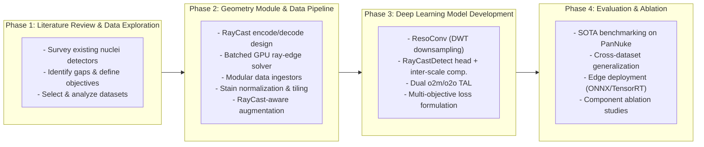

# Research Workflow Diagram Suggestion (Mermaid)

Suggested layout for `fig/research-workflow.tex` -- 4 sequential phases, no feedback loops.

```mermaid
flowchart LR
    subgraph P1["Phase 1: Literature Review & Data Exploration"]
        direction TB
        A["- Survey existing nuclei detectors\n- Identify gaps & define objectives\n- Select & analyze datasets"]
    end

    subgraph P2["Phase 2: Geometry Module & Data Pipeline"]
        direction TB
        B["- RayCast encode/decode design\n- Batched GPU ray-edge solver\n- Modular data ingestors\n- Stain normalization & tiling\n- RayCast-aware augmentation"]
    end

    subgraph P3["Phase 3: Deep Learning Model Development"]
        direction TB
        C["- ResoConv (DWT downsampling)\n- RayCastDetect head + inter-scale comp.\n- Dual o2m/o2o TAL\n- Multi-objective loss formulation"]
    end

    subgraph P4["Phase 4: Evaluation & Ablation"]
        direction TB
        D["- SOTA benchmarking on PanNuke\n- Cross-dataset generalization\n- Edge deployment (ONNX/TensorRT)\n- Component ablation studies"]
    end

    P1 --> P2 --> P3 --> P4
```
